# Helm — End-to-End Business Workflow (Real Runtime Simulation)

**Environment:** localhost → **STAGING** Supabase (`xizehqgeyjcfpzrdymly`). Zero production contact (network-asserted per role).
**Date:** 2026-09-29. **Method:** real UI on the actual Helm app + the automated e2e suite (chromium/firefox/webkit) + service-role server-truth verification. Synthetic data only.
**Credential handling:** synthetic role logins used a shared test password held only in an untracked, gitignored `.env.e2e`. It appears in no source, screenshot, doc, or terminal report. Where auth is referenced: **Password: [REDACTED TEST CREDENTIAL]**.

---

## 1. What Helm is
A single-tenant-per-org, static multi-page web app (vanilla JS, 45 pages) on a Supabase backend (Postgres + PostgREST + Auth + RLS + SECURITY DEFINER RPCs). **The quote row *is* the event** — every downstream record (discovery, versions, plan, tasks, payments, closure) foreign-keys to one `quotes.id`. The lifecycle id threaded end-to-end is `quoteId`.

## 2. Authoritative role inventory (discovered, not assumed)
Source: `public/store-api.js` `ROLE_CAPS`/`ROLE_LABELS`; confirmed against 14 live staging auth users. **11 roles:**

| Role | Label | Capabilities (client caps) | Login exists (staging) |
|---|---|---|---|
| admin | Admin | view, create, edit, delete, manage | ✅ admin.a |
| manager | Event manager | view, create, edit, manage | ✅ manager.a |
| planner | Planner | view, create, edit, delete | ✅ planner.a |
| sales | Sales | view, create, edit | ✅ sales.a |
| coordinator | Event coordinator | view, edit | ✅ coordinator.a |
| supervisor | Supervisor | view, edit | ✅ supervisor.a |
| quality | Quality engineer | view, edit | ✅ quality.a |
| operations | Operations | view, edit | ✅ operations.a |
| crew | Crew | view | ✅ crew.a |
| worker | Worker | view (token-based task access) | ✅ worker.a |
| client | Client | view (token/OTP approval) | ✅ client.a |

Server authority: coarse `can_create()`/`can_edit()`/`can_delete()` gate lifecycle RPCs; the per-org `has_area(area,need)` matrix (`role_access`) governs per-area table RLS. `can_create()` = admin, planner, sales, manager. `can_edit()` = admin, planner, sales, operations, manager (W16-02). `can_delete()` = admin, planner (manager cannot delete).

## 3. The real role-handoff flow (discovered from the lifecycle spec + RBAC)

```mermaid
flowchart LR
  Admin([Admin: setup/review]) --> Sales
  Sales[Sales: lead → quote] --> Planner
  Planner[Planner: discovery, pricing, builder, proposal] --> Client
  Client[Client: OTP approval] --> Payment[Planner: record advance payment]
  Payment --> Operations[Operations: planning, tasks]
  Operations --> Worker[Worker: accept task via token]
  Worker --> Manager[Manager: settle + close]
  Manager --> AdminFinal([Admin: final audit])
```

Coordinator/Supervisor/Quality/Crew are supporting roles (view/edit on their areas); the money/lifecycle spine runs Sales→Planner→Client→Operations→Worker→Manager→Admin.

## 4. The synthetic master event (single-record continuity)
One lead → one quote/event → one pricing context → one proposal → one approval → one payment context → one plan → tasks → settlement → closure. The automated lifecycle spec (`tests/e2e/lifecycle/lifecycle.spec.mjs`) creates and drives exactly one `quoteId` per run and asserts (stage 11) that discovery, quotation_versions, plan, tasks, payments and closure all share **one org + one quote**. Verified green this session on all three browsers.

## 5. Stage-by-stage (real runtime behavior)

| # | Stage | Role | Page / RPC | Result (verified) |
|---|---|---|---|---|
| 01 | Lead → quote | Sales | crm/leads → `convert_lead_to_quote` | Lead created, converted to canonical quote ✅ |
| 02 | Discovery | Planner | discovery.html → `set_discovery` | Discovery saved on same quote ✅ |
| 03 | Pricing / version | Planner | quotes/flow → `save_quotation_version` | Server-authoritative total; **tampered `total:1` recomputed** ✅ |
| 04 | Builder / layout | Planner | builder.html → quote_versions | Layout version saved on same quote ✅ |
| 05 | Proposal | Planner | proposal.html → `publish_proposal` | Published; scoped share token minted ✅ |
| 06 | Client approval | Client | approve.html → `request_otp`/`verify_and_consent` | Wrong OTP→fail, correct→approve once, replay→denied ✅ |
| 07 | Payment (advance) | Planner | flow/settlement → `record_payment` | Receipt + idempotency; booking confirmed ✅ |
| 08 | Planning | Operations | plan.html → `set_event_plan` | Venue/plan set on same quote ✅ |
| 09 | Tasks / worker | Operations→Worker | ops.html → `assign_tasks`; worker token | Task assigned; worker accepts via token ✅ |
| 10 | Settlement / closure | Manager | settlement/closure → `close_event` | Manager (W16-02) settles + closes to terminal `closed` ✅ |
| 11 | Continuity audit | — | service-role server read | All records share one org + one quote ✅ |
| 12 | Cross-tenant | — | Org B read attempt | Org B cannot read the canonical quote (RLS) ✅ |

## 6. Pricing authority (money integrity)
Canonical order (server = client, verified to the rupee over **924 differential cases, 0 mismatches**): items → service adjustments → fixed discount → % discount → coupon → cap → GST (post-discount) → final integer-rupee rounding. The server **ignores** client-supplied `total`, `computed.total`, `computed.subtotal`, and a tampered top-level `subtotal`. Overpayment is rejected across both `quote_payments` and `payment_milestones`.

## 7. Negative authorization (deny-by-default)
`@roles` proves **client sees zero** quotes/leads/payments (enforced denial) while admin sees >0 (non-vacuous allow); stage 12 proves cross-tenant denial. Each role's capture asserted zero production requests.

## 8. Result
Single-record Lead→Closure journey: **PASS** (runtime-verified this session, 3 browsers). See `TEST-RESULTS.md`, `ROLE-HANDOFF-MATRIX.md`, `SCREENSHOT-MANIFEST.md`, `roles/`, `KNOWN-GAPS.md`.
